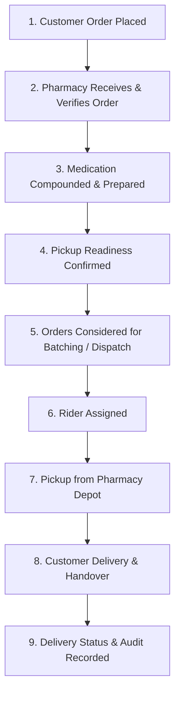
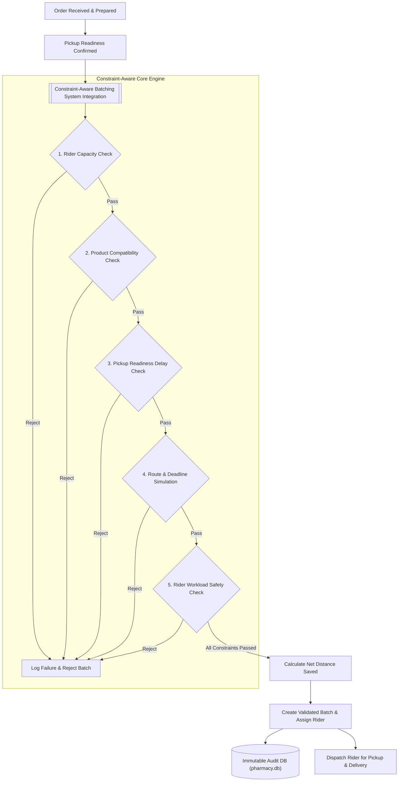

# Field Workflow Map: Pharmacy Delivery Batching Integration

## 1. Existing Pharmacy Delivery Workflow

The traditional operational workflow for time-sensitive pharmacy deliveries proceeds linearly:

---

## 2. Legacy Operational Problem

In the legacy workflow:
- **Individual Delivery**: Orders are dispatched one-by-one, resulting in high courier distance, fuel cost, and poor rider utilization.
- **Naive Distance Batching**: Dispatchers group nearby orders strictly by geographic proximity. However, this causes severe operational failures:
  - **Late Deliveries**: Adding stops causes promised delivery deadlines to be missed.
  - **Product Incompatibility**: Refrigerated vaccines (ColdChain) are accidentally grouped with volatile chemicals or narcotics.
  - **Unready Pickups**: Riders are dispatched before medication compounding is completed, wasting rider time at the pharmacy.
  - **Unsafe Rider Workloads**: Riders are assigned excessively long multi-stop routes exceeding fatigue limits.

---

## 3. Integrated Constraint-Aware Architecture

The **Constraint-Aware Batching System** seamlessly integrates at **Stage 5 (Orders Considered for Batching)** without disrupting existing pharmacy systems:

---

## 4. Operational Stage Summary

| Stage | Action | Legacy Risk | Constraint-Aware Solution |
| :--- | :--- | :--- | :--- |
| **1. Order Reception** | Customer places prescription | Manual delay | Structured priority & deadline tags |
| **2. Preparation** | Pharmacist compounding | Unverified readiness | Real-time `pickup_ready_time` tracking |
| **3. Batching Decision** | Grouping orders for courier | Deadline breaches & product mixing | Hard-constraint engine checks all 5 safety rules |
| **4. Routing & Dispatch** | Generating courier sequence | Sub-optimal routes & fatigue | TSP sequence optimization with safety buffer |
| **5. Audit & Compliance** | Logging dispatch history | Overwritten / unverified logs | Immutable SQLite audit history (`audit_log`) |
